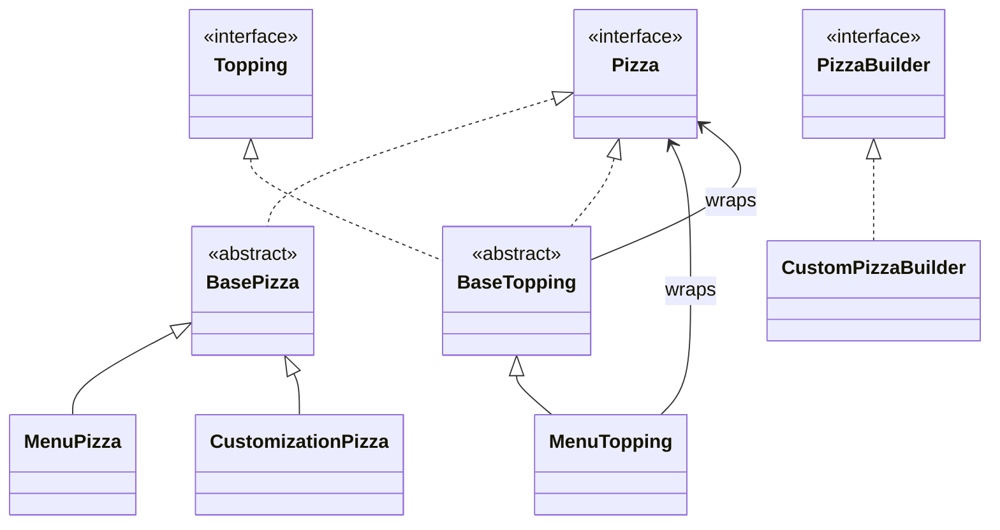
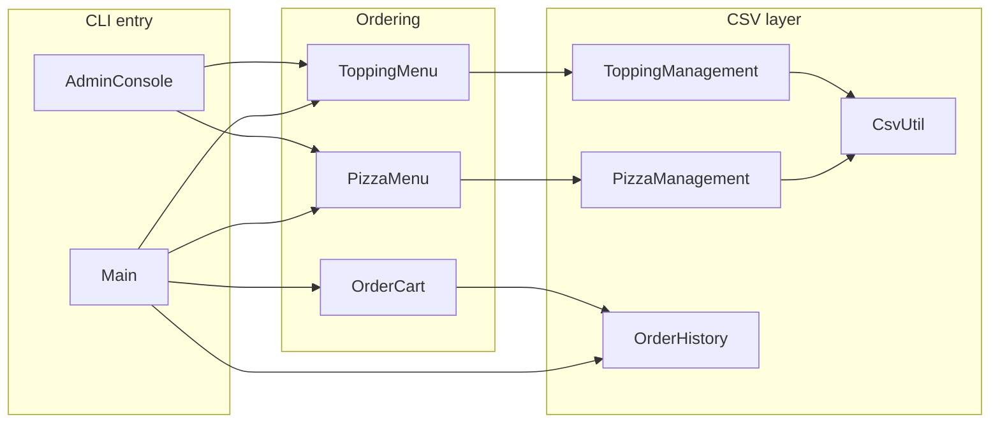

# Pizza Palace (CS3343)

CLI pizza ordering system with a customer flow, optional admin panel, CSV-backed menus, and order history. All sources live in the default package (flat layout).

## Build and run

From the project root (where the `.java` and `.csv` files are):

```bash
javac *.java
java Main
```

Optional pricing checks:

```bash
java -ea PizzaPricingTest
```

## Data files

| File | Role |
|------|------|
| `pizzas.csv` | Menu pizzas (managed by `PizzaManagement`) |
| `toppings.csv` | Toppings (managed by `ToppingManagement`) |
| `orders.csv` | Past orders (managed by `OrderHistory`) |

## Class structure

### Type hierarchy (domain model)

Decorator-style toppings wrap a `Pizza`: cost and name accumulate outward.



### Application and persistence



### Nested types

| Outer class | Inner type | Purpose |
|-------------|------------|---------|
| `PizzaManagement` | `PizzaItem` | Row from `pizzas.csv` |
| `ToppingManagement` | `ToppingItem` | Row from `toppings.csv` |
| `OrderHistory` | `OrderRecord` | Parsed history line |
| `CustomPizzaBuilder` | `ToppingSelection` | Builder state |
| `PizzaPricingTest` | `MockPizza` | Test double implementing `Pizza` |

### File index (quick reference)

| Class | Responsibility |
|-------|----------------|
| `Main` | Customer CLI: menu paging, custom pizza flow, cart, checkout |
| `AdminConsole` | Admin CLI: CRUD on pizzas and toppings |
| `Pizza` / `Topping` / `PizzaBuilder` | Core interfaces |
| `BasePizza` | Shared `Pizza` fields and accessors |
| `MenuPizza` | Fixed menu item |
| `CustomizationPizza` | Base for build-your-own |
| `BaseTopping` | Decorator base implementing `Pizza` and `Topping` |
| `MenuTopping` | One topping layer with additive cost |
| `CustomPizzaBuilder` | Implements `PizzaBuilder` using `MenuTopping` stack |
| `OrderCart` | Line items, totals, receipt text |
| `OrderHistory` | Append and display orders in `orders.csv` |
| `PizzaMenu` / `ToppingMenu` | Facade over management classes for UI |
| `PizzaManagement` / `ToppingManagement` | Load/save CSV menu data |
| `CsvUtil` | Escaping and parsing for CSV lines |
| `PizzaPricingTest` | Manual `main` tests for cart and price math |
